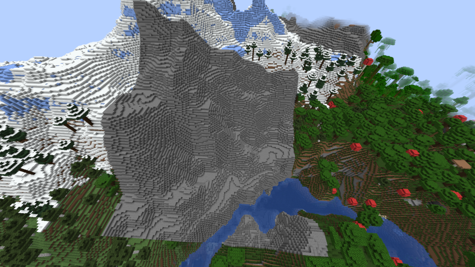
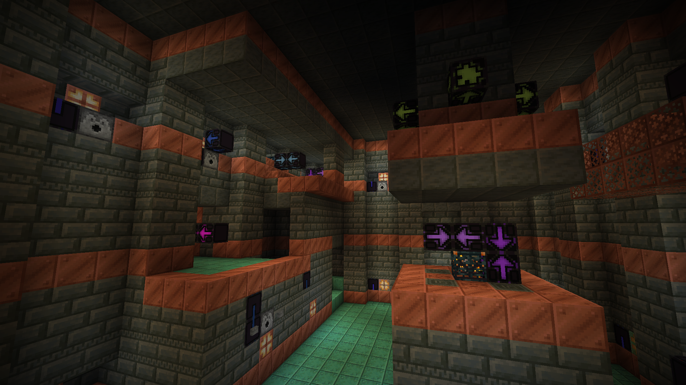
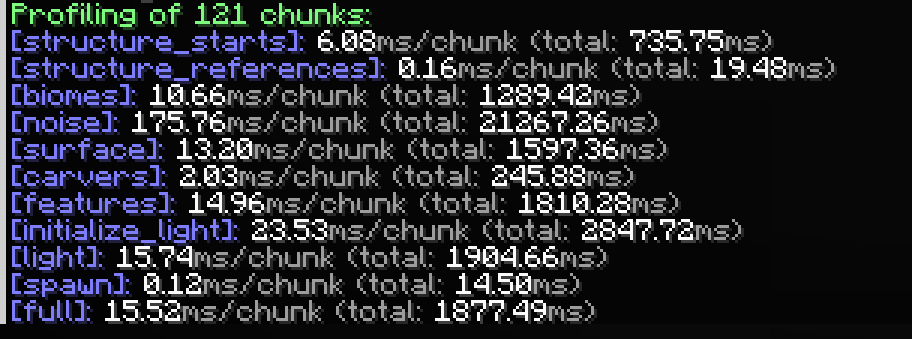
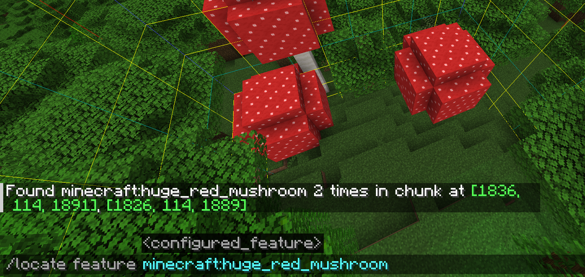

# Worldgen Devtools

This is a mod that provides tools simlifying the creation of worldgen datapacks and mods.

## Registry (worldgen) Reloading

*Needs be enabled per world using the `reloadRegistries` gamerule.*

**Warning: While this should be fairly stable, this tool can probably still corrupt your worlds. So only enable in testing worlds**

Allows the reloading of registry content (such as all worldgen data) using the `/reload` command, or when enabling or
disabling a datapack using the `/datapack` command. Without this mod, the world needs to be reopened for changes to take
effect.

Entries are never removed from registries, even when no longer present in the loaded datapacks. Instead, they are marked as
outdated, so that they don't have an effect on world generation and can't be referenced from other datapack files.
Existing chunks can still use the outdated entries though, until the world is reopened. The world-height and noise shape
(i.e. height and cell size) can't be reloaded.

### Client Syncronization

Some reloaded data affects the client, such sa biome colors, dimension types, and armor trims. In multiplayer, dimension
and biome effects need to be synconized. This causes the client to redraw all chunks. If this behaviour is undesireble,
it can be disabled using the `syncClients` gamerule.

## Reset Chunks

The `/resetchunks [<range>]` command resets the chunks surrounding the player in the specified range - regenerating it with the current worldgen data and settings. Defaults to `0` (i.e. only the current chunk). If you want to reset a structure, you need to reset the chunk of the structure start.

*Note: This implementation actually used the normal worldgen thread, and thus has much better performance than the unregistered vanilla command.*

## Colored Jigsaw Blocks

Colors Jigsaw blocks based on their specified "Name" or "Target Name". If a "Name" other than `minecraft:empty` is set,
the jigsaw block is colored based on the hash of the "Name". Otherwise, if a "Target Name" other than `minecraft:empty`
is set, the jigsaw block is colored based on the hash of the "Target Name".

If both "Name" and "Target Name" are set to `minecraft:empty` the jigsaw block is rendered *deactivated*, with grayed
out arrows and connectors.

In the inventory, if a jigsaw block has stored NBT (Shift+Pick), then it is rendered with the associated color and a
tooltip indicated the "Name", "Target Pool", and "Target Name".

## Get Density Command

Command to debug the values of density functions are any position.

### `/getDensity density_function <df> [<pos>]`

Returns the value of the density function `df` at the specified postion (or the position of the player)

### `/getDensity noise_router <entry> [<pos>]`

Returns the value of the density function specified in the given entry of the noise router of the current dimension at
the specified postion (or the position of the player)

## Profiling of Worldgen Performance

The time it took to generate each step of each chunk is recorded and saved in each chunk. To access it, use
the `/chunkprofiling <range>` command. Range controlls the amount of chunks to average the performance over; defaults
to `0`.

## Locate Feature

Use `/locate featrue <configured_feature>` to locate a configured feature nearby. If the current chunk contains the feature
multiple times, it will list the up to 5 closest positions. This only works if the chunk is generated while this mod is
installed.

## Logging improvements
- Empty height ranges in placed features also log the placed feature that causes the problem. 

## Chase

The `/chase` command provides options to syncronize of the player positions between two different instances of Minecraft. Usefull for
comparing differences in worldgen. This is a vanilla command, simply registered by this mod.

## Gamerules

Gamerules added by this mod:

| Gamerule                |                                                                                                                                                                                                                                                                                                    |
|-------------------------|----------------------------------------------------------------------------------------------------------------------------------------------------------------------------------------------------------------------------------------------------------------------------------------------------|
| `maxChunkStatus`        | Which steps of world generation should be done?   -> `NOISE_ONLY`: Generates stone, air, water and lava only.   -> `SURFACE`: Applies the surface rules.   -> `SURFACE_AND_CARVERS`: Applies surface rules, and carvers.   -> `ALL`: Applies surface rules, carvers, and features. |
| `applyProcessorLists`   | Should processor lists of structures be applied?                                                                                                                                                                                                                                                   |
| `applyGravityProcessor` | Should terrain matching structure pieces match the terrain?                                                                                                                                                                                                                                        |
| `keepJigsaws`           | Should the jigsaw blocks be kept after structure generation?                                                                                                                                                                                                                                       |
| `reloadRegistries`      | Should the `/reload` command also reload registries?                                                                                                                                                                                                                                               |
| `syncClients`           | Should all clients be resend the registry content after reloading?                                                                                                                                                                                                                                 |
| `saveChunks`            | Should chunks be saves? Old chunks are not deleted when disabling.                                                                                                                                                                                                                                 |

